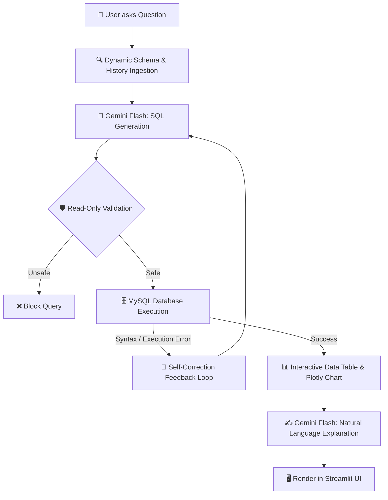

Here is a professional, production-ready **`README.md`** file tailored specifically for your project. It includes architecture diagrams, database setup scripts, feature highlights, and interview talking points to make your GitHub repository stand out.

---

```markdown
# 📊 Supply Chain Database AI Analyst (Text-to-SQL)

An enterprise-ready AI analytics dashboard that allows supply chain managers, analysts, and business stakeholders to query relational MySQL databases using plain English. 

Powered by **Google Gemini Flash**, **Streamlit**, **MySQL**, and **Plotly**, this system dynamically discovers database schemas, safely converts natural language into multi-table SQL queries, auto-visualizes metrics, and interprets tabular data into clear business insights.

---

## 🌟 Key Features

* **🗣️ Natural Language to SQL (Text-to-SQL)**: Ask complex supply chain questions in plain English—no SQL expertise required.
* **🔍 Zero-Hardcoding Schema Discovery**: Queries MySQL's `INFORMATION_SCHEMA` at runtime to automatically identify tables, column types, primary keys, and foreign keys. Scales dynamically to any schema changes.
* **🔗 Intelligent Multi-Table Joins**: Automatically bridges normalized star schemas (e.g., joining `products`, `regions`, and `supply_chain_records`).
* **🛡️ Security & Read-Only Guardrails**: Enforces strict read-only execution (`SELECT`, `SHOW`, `EXPLAIN`). Blocks destructive statements (`DROP`, `DELETE`, `UPDATE`, `INSERT`, `TRUNCATE`).
* **🔄 Self-Healing SQL Engine**: If MySQL encounters a syntax or grouping error, the system feeds the database error back to Gemini to self-correct and re-execute automatically.
* **📈 Dynamic Visualizations**: Automatically detects numeric aggregates and renders interactive **Plotly** charts.
* **✍️ Business Insights**: Translates raw database rows into plain-English executive summaries and operational recommendations.

---

## 🏗️ Architecture & Workflow



---

## 🗄️ Database Architecture

The application is optimized for supply chain star schemas consisting of dimension tables connected through a central transactional fact table:

```
[products] (Dimension) ──(product_id)──► [supply_chain_records] (Fact) ◄──(region_id)── [regions] (Dimension)
```

### Schema Overview:

1. **`products`**:
   * `product_id` (VARCHAR, PK) — Unique product identifier
   * `product_name` (VARCHAR) — Name of the item
   * `category` (VARCHAR) — Item classification

2. **`regions`**:
   * `region_id` (INT, PK, Auto Increment) — Unique region identifier
   * `region_name` (VARCHAR, Unique) — Geographic market (e.g., North, West, APAC)

3. **`supply_chain_records`**:
   * `record_id` (INT, PK, Auto Increment) — Transaction ID
   * `record_date` (DATE) — Date of entry
   * `product_id` (VARCHAR, FK) — Reference to `products`
   * `region_id` (INT, FK) — Reference to `regions`
   * `inventory_level` (INT) — Stock on hand
   * `units_sold` (INT) — Sales volume
   * `lead_time_days` (INT) — Restock / shipping fulfillment duration
   * `shipping_cost` (DECIMAL) — Freight/shipping cost
   * `supplier_status` (ENUM) — `'Reliable'`, `'Delayed'`, `'At Risk'`

---

## 🚀 Getting Started

### 1. Prerequisites
* Python 3.10+
* MySQL Server (8.0+ recommended)
* Google Gemini API Key ([Get an API Key here](https://aistudio.google.com/))

### 2. Clone the Repository
```bash
git clone https://github.com/your-username/supply-chain-ai-analyst.git
cd supply-chain-ai-analyst
```

### 3. Install Dependencies
```bash
pip install -r requirements.txt
```

*(Create a `requirements.txt` containing:)*
```text
streamlit
pandas
mysql-connector-python
plotly
google-genai
```

### 4. Setup MySQL Database
Open your MySQL Workbench or CLI and run:

```sql
CREATE DATABASE IF NOT EXISTS supply_chain_db;
USE supply_chain_db;

CREATE TABLE products (
    product_id VARCHAR(10) PRIMARY KEY,
    product_name VARCHAR(100),
    category VARCHAR(50)
);

CREATE TABLE regions (
    region_id INT AUTO_INCREMENT PRIMARY KEY,
    region_name VARCHAR(50) UNIQUE NOT NULL
);

CREATE TABLE supply_chain_records (
    record_id INT AUTO_INCREMENT PRIMARY KEY,
    record_date DATE NOT NULL,
    product_id VARCHAR(10) NOT NULL,
    region_id INT NOT NULL,
    inventory_level INT NOT NULL,
    units_sold INT NOT NULL,
    lead_time_days INT NOT NULL,
    shipping_cost DECIMAL(10,2) NOT NULL,
    supplier_status ENUM('Reliable','Delayed','At Risk') NOT NULL,
    CONSTRAINT fk_scr_products FOREIGN KEY (product_id) REFERENCES products(product_id),
    CONSTRAINT fk_scr_regions FOREIGN KEY (region_id) REFERENCES regions(region_id)
);
```

### 5. Launch the Application
```bash
streamlit run app.py
```

---

## 💡 Example Queries to Test

Try entering these plain-English business questions in the app:

| Query Type | Plain English Prompt | Tables Joined |
| :--- | :--- | :--- |
| **Stockout Risk** | *"Which products have high units sold (>50) but inventory below 20, along with their region?"* | 3 tables |
| **Logistics Efficiency** | *"What is the total shipping cost and average lead time for each category per region?"* | 3 tables |
| **Supplier Health** | *"Show all products and regions where supplier status is 'Delayed' or 'At Risk'."* | 3 tables |
| **Auto-Chart (Bar)** | *"Show total shipping cost by region name only."* | 2 tables (renders chart) |
| **Auto-Chart (Bar)** | *"Show total units sold by product category only."* | 2 tables (renders chart) |

---

## ⚡ Engineering Highlights: Why Gemini Flash?

* **Dual-Call Latency Optimization**: Each question requires two LLM calls (SQL generation + result interpretation). Gemini Flash delivers sub-second token generation, keeping end-to-end response times under ~2.5 seconds.
* **Cost Efficiency (FinOps)**: Dynamically sending complete database schemas, foreign keys, and conversation history consumes 500–2,000+ input tokens per question. Flash delivers high accuracy at ~90% lower operational cost than flagship models.
* **1M+ Token Context Window**: Easily accommodates enterprise-scale schemas with hundreds of tables and rich column descriptions without truncation.

---

## 🔒 Security & Best Practices

1. **Strict Read-Only Enforcement**: Query strings are validated before dispatch; any non-read-only queries are blocked.
2. **Credential Privacy**: Passwords and API keys are masked using Streamlit's `type="password"` inputs and stored exclusively in runtime memory (`st.session_state`).
3. **Resilient Connections**: Automatic connection pinging and reconnection handling prevent MySQL timeout drops during idle periods.

---

